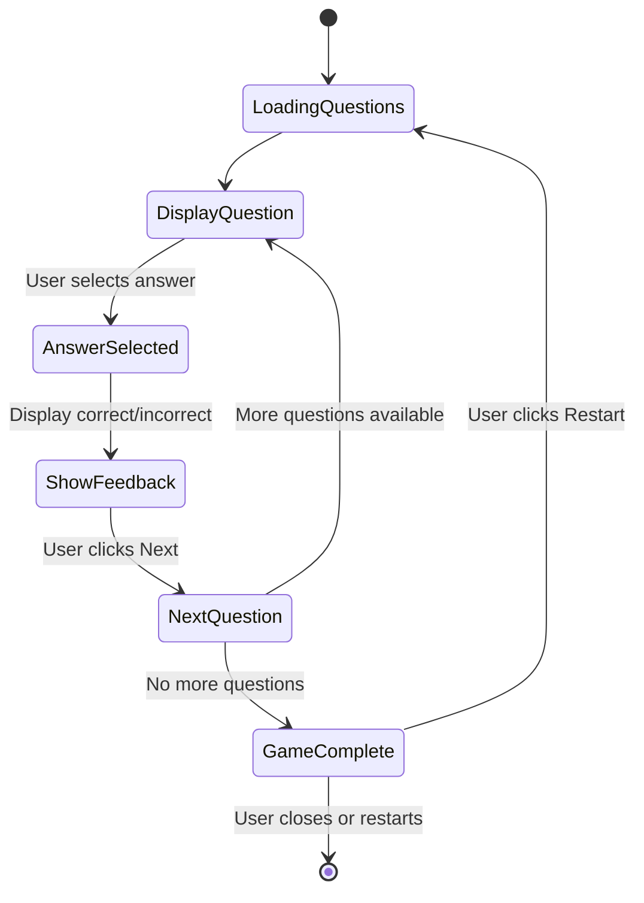

# Design Document: Millionaire Flashcard Game

## Overview

The Millionaire Flashcard Game is a static React application that presents trivia questions in a multiple-choice format. The application loads questions from a local JSON file, displays them one at a time, provides immediate feedback on user selections, and tracks performance metrics throughout the session.

## Architecture

### Technology Stack
- **React 18+**: Core UI framework using functional components and hooks
- **Vite**: Build tool and development server for fast development experience
- **CSS Modules or Tailwind CSS**: Styling solution for component-based styles
- **TypeScript**: Type safety for better development experience (optional but recommended)

### Application Structure
```
millionaire-flashcard-game/
├── public/
│   └── data/
│       └── questions.json          # Question bank
├── src/
│   ├── components/
│   │   ├── Question.jsx            # Question display component
│   │   ├── AnswerOption.jsx        # Individual answer button
│   │   ├── ScoreBoard.jsx          # Score tracking display
│   │   ├── GameComplete.jsx        # End game summary
│   │   └── GameControls.jsx        # Next/Restart buttons
│   ├── hooks/
│   │   └── useGameState.js         # Custom hook for game logic
│   ├── App.jsx                     # Main application component
│   ├── main.jsx                    # Application entry point
│   └── index.css                   # Global styles
├── package.json
└── vite.config.js
```

## Components and Interfaces

### Data Model

**Question Object Structure:**
```json
{
  "id": "string",
  "question": "string",
  "answers": ["string", "string", "string", "string"],
  "correctAnswer": 0-3
}
```

### Component Hierarchy

```
App
├── ScoreBoard
├── Question
│   └── AnswerOption (x4)
├── GameControls
└── GameComplete
```

### Component Specifications

#### App Component
- **Purpose**: Root component managing overall game state
- **State**:
  - `currentQuestionIndex`: number
  - `score`: { correct: number, incorrect: number }
  - `selectedAnswer`: number | null
  - `questions`: Question[]
  - `gameComplete`: boolean
- **Responsibilities**:
  - Load questions from JSON on mount
  - Manage game flow and state transitions
  - Coordinate child components

#### ScoreBoard Component
- **Props**: `correct: number`, `incorrect: number`, `total: number`
- **Purpose**: Display current performance metrics
- **Responsibilities**:
  - Show correct answer count
  - Show incorrect answer count
  - Show progress (e.g., "Question 5 of 15")

#### Question Component
- **Props**: 
  - `question: string`
  - `answers: string[]`
  - `correctAnswer: number`
  - `selectedAnswer: number | null`
  - `onAnswerSelect: (index: number) => void`
- **Purpose**: Display question text and answer options
- **Responsibilities**:
  - Render question text prominently
  - Render four AnswerOption components
  - Pass selection handler to children
  - Show visual feedback after answer selection

#### AnswerOption Component
- **Props**:
  - `text: string`
  - `index: number`
  - `label: string` (A, B, C, or D)
  - `isSelected: boolean`
  - `isCorrect: boolean`
  - `showFeedback: boolean`
  - `onSelect: () => void`
- **Purpose**: Render individual answer button
- **Responsibilities**:
  - Display answer text with letter label
  - Handle click events
  - Show visual states: default, selected, correct, incorrect
  - Disable interaction after selection

#### GameControls Component
- **Props**:
  - `onNext: () => void`
  - `onRestart: () => void`
  - `showNext: boolean`
  - `showRestart: boolean`
- **Purpose**: Provide navigation controls
- **Responsibilities**:
  - Show "Next Question" button when answer is selected
  - Show "Restart Game" button when game is complete

#### GameComplete Component
- **Props**: `correct: number`, `incorrect: number`, `total: number`
- **Purpose**: Display final results
- **Responsibilities**:
  - Show completion message
  - Display final score statistics
  - Calculate and show percentage

### Custom Hook: useGameState

**Purpose**: Encapsulate game logic and state management

**Returns**:
```javascript
{
  currentQuestion: Question | null,
  selectedAnswer: number | null,
  score: { correct: number, incorrect: number },
  currentQuestionIndex: number,
  totalQuestions: number,
  gameComplete: boolean,
  selectAnswer: (index: number) => void,
  nextQuestion: () => void,
  restartGame: () => void
}
```

**Logic**:
- Load questions from JSON on initialization
- Track current question index
- Handle answer selection and scoring
- Manage progression through questions
- Detect game completion
- Reset game state

## Data Models

### Questions JSON Structure
```json
{
  "questions": [
    {
      "id": "q1",
      "question": "What is the capital of Australia?",
      "answers": [
        "Sydney",
        "Melbourne",
        "Canberra",
        "Brisbane"
      ],
      "correctAnswer": 2
    }
  ]
}
```

### Game State
```javascript
{
  questions: Question[],
  currentQuestionIndex: number,
  selectedAnswer: number | null,
  score: {
    correct: number,
    incorrect: number
  },
  gameComplete: boolean
}
```

## User Flow



## Error Handling

### JSON Loading Errors
- **Scenario**: questions.json fails to load or is malformed
- **Handling**: Display error message to user with retry option
- **Fallback**: Provide sample questions embedded in code

### Empty Question Bank
- **Scenario**: questions.json contains no questions
- **Handling**: Display message indicating no questions available

### Invalid Question Data
- **Scenario**: Question object missing required fields
- **Handling**: Skip invalid questions and log warning to console
- **Validation**: Check for required fields on load

## Testing Strategy

### Unit Tests
- Test useGameState hook logic:
  - Score calculation
  - Question progression
  - Game completion detection
  - Restart functionality
- Test component rendering with various props

### Integration Tests
- Test complete user flow from start to finish
- Test answer selection and feedback display
- Test score tracking accuracy

### Manual Testing
- Verify visual feedback is clear and intuitive
- Test responsive design on different screen sizes
- Verify accessibility (keyboard navigation, screen readers)

## Styling Approach

### Visual Design Principles
- Clean, modern interface inspired by quiz show aesthetics
- High contrast for readability
- Clear visual feedback for interactions
- Responsive design for mobile and desktop

### Color Scheme
- Correct answer: Green (#4CAF50)
- Incorrect answer: Red (#F44336)
- Selected (before feedback): Blue (#2196F3)
- Default state: Neutral gray
- Background: Dark theme option for reduced eye strain

### Layout
- Centered content with maximum width for readability
- Question text prominently displayed at top
- Answer options in 2x2 grid or vertical list
- Score board fixed at top or side
- Adequate spacing between interactive elements

## Performance Considerations

- Questions loaded once on mount, cached in memory
- No unnecessary re-renders (use React.memo where appropriate)
- Minimal bundle size (static site, no heavy dependencies)
- Fast initial load time with Vite optimization

## Accessibility

- Semantic HTML elements
- ARIA labels for interactive elements
- Keyboard navigation support (Tab, Enter, Space)
- Focus indicators for keyboard users
- Screen reader announcements for score updates
- Sufficient color contrast ratios
